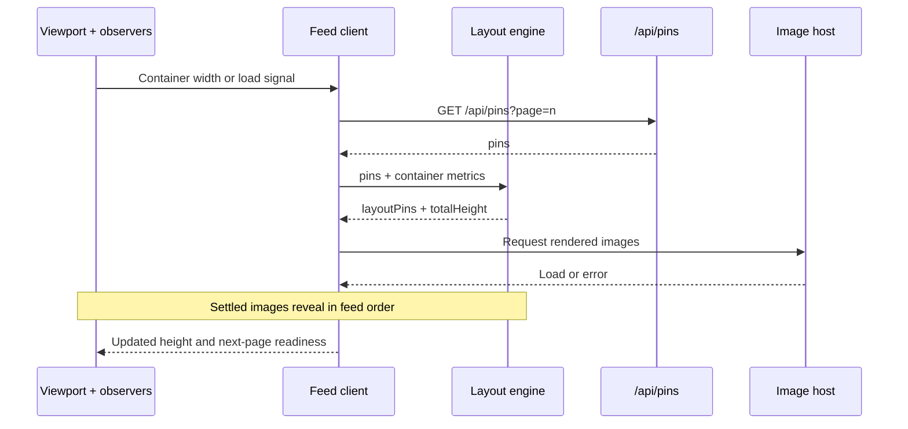

export const metadata = {
  title: "Responsive Masonry Feed",
  category: "Frontend Systems",
  readingTime: "12 min read"
};

# Responsive Masonry Feed

A Pinterest-style feed looks like a visual problem, but most of the difficult
work happens outside the layout itself. Images arrive at different times,
containers change width, short pages fail to create scroll space, and one broken
request can prevent everything behind it from appearing.

The goal of this implementation was to make those behaviors predictable. Pins
should keep their place while loading, appear in feed order, and continue to load
without overlapping requests or leaving a tall viewport half empty.

## The Masonry Pattern

Masonry takes its name from stonemasonry. Stones of different heights settle
into the spaces left by the pieces around them, creating a waterfall effect in
which the elements appear to interlock like a puzzle.

Applied to an image feed, this pattern creates a visually dense, curated
mood-board effect. It uses the available space efficiently without cropping
every image into the same shape, allowing portraits, landscapes, and smaller
details to keep their variety.

### Why CSS columns are not enough

The feed still has a meaningful sequence even though it is presented as a
two-dimensional layout. That sequence should remain predictable in the DOM so
images can reveal in order, keyboard navigation follows the feed, and each new
page continues naturally from the previous one.

CSS multi-column layout fills one column from top to bottom before moving to the
next. As a result, items that appear next to one another may be far apart in the
DOM. Loading and keyboard focus can therefore move down a column instead of
across the order a user expects to explore.

Flexbox preserves source order, but wrapped items still belong to rows. A tall
item determines the row height and leaves unused vertical space below its
shorter neighbors, so it cannot produce the tightly packed waterfall layout.

This implementation uses absolute positioning instead. The pins remain in API
order in the DOM, while the layout engine calculates the exact `left` and `top`
coordinates for each one. Visual placement is separated from document order,
giving the feed precise packing without sacrificing ordered image reveal,
predictable keyboard behavior, or sequential pagination.

## Architecture

The high-level design shows the boundaries between the browser, feed client,
API, layout engine, and image host.

### High-Level Design



## Building the Layout Engine

The API returns a stable frame height with each pin. That lets the feed reserve
space before the image has loaded instead of measuring cards after they appear.

```ts
type Pin = {
  id: number;
  url: string;
  alt: string;
  height: number;
};
```

The layout begins by calculating how many columns fit inside the measured
container. Any remaining width is shared between those columns so the feed does
not end with unused space along its right edge.

```text
columnCount = max(1, floor((containerWidth + gap) / (minColumnWidth + gap)))
columnWidth = (containerWidth - (columnCount - 1) * gap) / columnCount
```

An array tracks the current height of every column. For each pin, the engine
finds the smallest value in that array and places the pin in the corresponding
column. It then adds the pin height and gap to that column before processing the
next item.

```text
shortestColumn = index of minimum(columnHeights)
left = shortestColumn * (columnWidth + gap)
top = columnHeights[shortestColumn]

columnHeights[shortestColumn] = top + pin.height + gap
```

The tallest final column becomes the height of the feed container. This matters
because absolutely positioned children do not contribute to normal document
flow. Without an explicit container height, content below the feed and the
pagination sentinel would be positioned incorrectly.

## Loading Without Layout Shifts

Every pin first renders as a skeleton using the dimensions provided by the API.
The real image occupies the same frame, so revealing it does not cause nearby
pins to move.

Each image waits for `img.decode()` before it is considered ready. Decoding can
finish in any order, but the feed reveals pins in their original sequence. A pin
that becomes ready early simply waits until all earlier pins in the same batch
have settled.

This creates a short lifecycle for every item:

```text
skeleton -> decoding -> waiting -> revealed
                  |
                  `-----------> fallback
```

Failures use the same settlement path as successful images. If an image errors
or exceeds its timeout, the skeleton is replaced with a stable fallback and the
reveal queue advances. A single unreliable image can never block the rest of the
batch indefinitely.

## Pagination Without Race Conditions

`IntersectionObserver` watches a sentinel below the masonry container. When the
sentinel approaches the viewport, the controller requests the next page.

That mechanism alone does not fill the first screen. On a tall display, the
initial response may be too short to create scroll space, leaving the sentinel
visible without a new scroll event. After each batch settles, the controller
checks the feed height and immediately loads another page when the viewport is
still not filled.

Both the sentinel and the viewport-fill check use the same loading guard. This
keeps pagination simple: several conditions may request more content, but only
one page request can be active at a time.

## Recalculating on Resize

The feed listens to its container with `ResizeObserver` rather than relying on
window resize events. This allows it to react when a sidebar opens, a parent
panel changes size, or the page layout changes without affecting the viewport.

When the width changes, the layout is rebuilt from the original pin records.
Previously calculated coordinates are never used as input for the next layout.
They were correct for an old column count and would introduce gaps or incorrect
placements if reused.

> Pins are source data. Their coordinates are derived data.

## Performance and Accessibility

The feed keeps frequently changing coordination values—such as request guards
and image settlement flags—in refs. These values need to survive asynchronous
work, but they do not need to trigger an additional render every time they
change.

Stable frames also help both performance and usability. They prevent layout
shift, make scroll behavior predictable, and keep keyboard focus aligned with
the original feed order. Images use meaningful alternative text supplied by the
API, while loading announcements remain quiet enough to avoid repeatedly
interrupting screen-reader users during pagination.

## The Tradeoff

Absolute positioning gives the feed deterministic ordering and precise control
over every pin. It also makes pagination easier to reason about because the
controller knows the exact bottom edge of the layout.

The cost is ownership. The application must calculate coordinates, maintain the
container height, and rebuild the layout whenever its available width changes.
CSS columns require less code, but their column-first ordering makes feed order
and incremental loading harder to control.

## Closing Thought

The shortest-column algorithm is the visible center of a masonry feed, but it is
not the hardest part. A dependable implementation comes from coordinating image
readiness, failure recovery, pagination, and responsive measurement so that no
single part of the system can prevent the others from moving forward.
