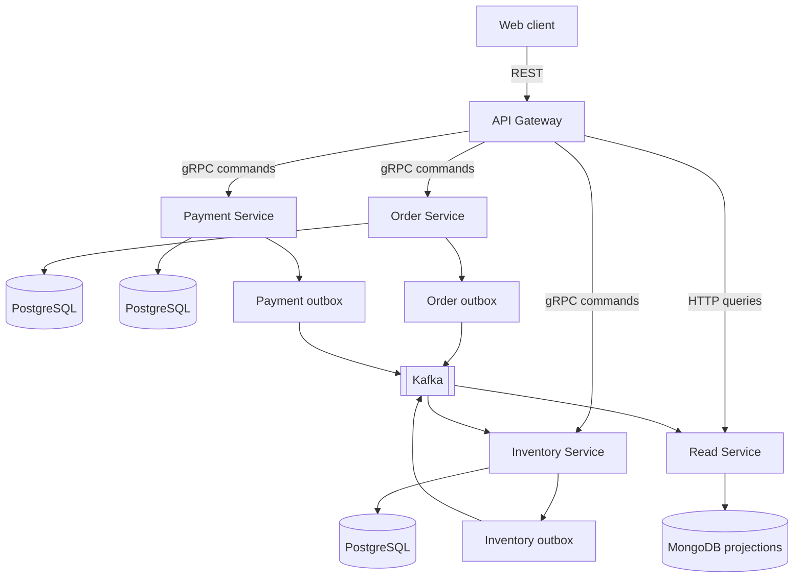

export const metadata = {
  title: "Distributed Order System",
  type: "Work in progress"
};

# Distributed Order System

An order platform looks like a sequence of simple actions: create an order,
reserve inventory, collect payment, and show the result. The difficulty appears
when each action belongs to a different service and any step can fail after an
earlier one has already succeeded.

This project explores that coordination problem beyond the browser boundary. It
is a work-in-progress system built around explicit service contracts, reliable
event publication, eventually consistent read models, and recovery paths for
partial failure.

## Why an Order System Becomes Distributed

Creating an order touches several kinds of state. Inventory must be authoritative,
pricing cannot be trusted from the client, payment has its own lifecycle, and the
product still needs a query-friendly view that can be rendered without joining
multiple write databases on every request.

A single CRUD service could hide those concerns behind one transaction. That
would be simpler to deploy, but it would not expose the problems this project is
intended to study: service ownership, contract evolution, duplicate events,
compensation, replay, and stale projections.

The system therefore separates commands from queries and gives orders,
inventory, payments, and read models their own boundaries. The browser only
talks to an API Gateway; internal topology remains a backend concern.

## Architecture

The high-level design separates the public product API from command services,
event propagation, and query projections.

### High-Level Design



## Keeping the Product Boundary Stable

The API Gateway is the only backend surface known to the web client. It handles
authentication, accepts REST commands, maps them into internal service calls,
and proxies query requests to the Read Service.

That boundary gives the product a stable contract even when the internal
services evolve. A change to inventory storage or payment coordination should
not require the browser to discover another hostname or understand a new
service graph.

Inside the system, command services communicate through generated gRPC
contracts. The value is not simply transport performance; request types, error
models, and service ownership are explicit and shared.

```text
CreateOrder
  -> validate the command
  -> reserve authoritative inventory and pricing
  -> persist the order and its items
  -> write an outbox event
  -> return the accepted order
```

## Publishing Events Without a Dual Write

Persisting an order and publishing an event are two separate operations. If the
database commit succeeds but the Kafka publish fails, downstream projections
never learn that the order exists. Publishing first creates the opposite risk:
consumers may receive an event for state that was never committed.

Each write service uses a transactional outbox. The domain change and its
pending event are stored in the same PostgreSQL transaction. A background
poller later publishes the event to Kafka and records that publication state.

> The transaction owns the state change. The outbox makes event delivery
> recoverable.

This does not create exactly-once delivery. Consumers must still tolerate the
same event more than once, which makes idempotency part of the service contract
rather than an optional optimization.

## Coordinating Inventory and Payment

An order cannot trust prices or stock quantities submitted by the browser. The
Order Service asks Inventory to reserve stock and return the authoritative
product data used to calculate the total.

Payment adds another independent state transition. A reservation may succeed
before a payment fails, or payment may succeed while a later event is delayed.
Saga-style workflows make those steps and their compensating actions explicit
instead of pretending they share one database transaction.

```text
order requested
  -> reserve inventory
  -> create pending order
  -> initiate payment
  -> confirm order

payment failure
  -> mark order as failed
  -> release inventory reservation
```

The payment and Saga paths are being implemented incrementally. Keeping them
visible in the design prevents the simpler happy path from becoming the only
path the architecture can support.

## Building the Read Side

Command services own normalized write models, but those models are not shaped
for product queries. The Read Service consumes order, inventory, and payment
events and projects MongoDB documents designed for the screens the gateway must
serve.

Order projections can combine status, totals, items, and timeline data in one
document. Inventory projections can expose stock state, effective price, and
version metadata without asking the UI to coordinate several services.

The tradeoff is eventual consistency. A successful command can return before
the corresponding projection has caught up, so the product needs explicit
pending states instead of assuming every read immediately reflects the latest
write.

## Designing for Failure and Replay

Kafka consumers can receive duplicates, restart between processing and
acknowledgement, or encounter an event they cannot currently handle. The Read
Service stores processed event IDs and applies version guards so repeated or
stale events do not overwrite the current projection.

Replay is treated as an operational requirement. If a projection bug is fixed,
the read model should be rebuildable from retained events rather than repaired
through manual database edits.

Cancellation follows the same principle. Cancelling an order publishes a state
change, Inventory restores the reservation, and the resulting inventory event
updates the read model. Recovery remains observable instead of becoming a
hidden cross-database mutation.

## Current State

The repository already contains the main structural pieces:

- an authenticated API Gateway with command and health routes;
- Order and Inventory gRPC services with PostgreSQL write models;
- transactional outbox and Kafka publishing code;
- MongoDB models for order and inventory projections;
- idempotent Kafka consumers and shared event contracts;
- Docker-based local infrastructure and service scripts.

The incomplete areas are equally explicit. Payment and Saga workflows are
still being implemented, long-running consumers and outbox pollers need a
dedicated background worker, and the Read Service still needs its HTTP query
surface. The web client remains scaffold-level until those runtime boundaries
are coherent.

This keeps the project honest: the architecture describes the intended system,
while the current-state section describes what can actually run today.

## The Tradeoff

Separating services creates clear ownership and useful failure boundaries, but
it also introduces asynchronous state, operational workers, event versioning,
replay, and more infrastructure than a monolith would require.

For a small product, that cost would be difficult to justify. For this project,
the complexity is the subject being explored. The system exists to make those
tradeoffs concrete rather than treating Kafka, CQRS, or microservices as labels
on an architecture diagram.

## Closing Thought

The API Gateway and service diagram are the visible center of a distributed
order system, but the harder work is deciding how the system behaves between
successful requests. Reliable publication, idempotent consumers, compensating
actions, replay, and honest pending states are what turn separate services into
one product.
